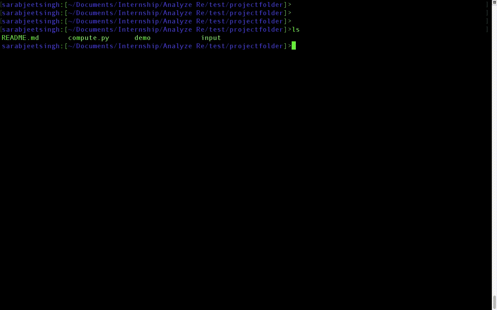
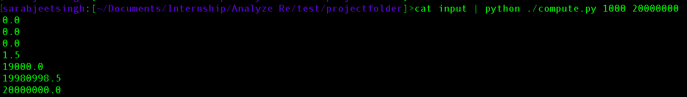

# Analyze-Re-compute

Compute is a command line utility, that can be invoked in common Linux operating systems, which accepts tabular (single-column) input via standard input and writes tabular (single-column) output. Lines of input and output will consist of only numerical values, and the program will transform the input values into output values according to some rules.

## Working demo



# Input

Input will consist of up to 100 lines of numbers - all decimal numbers between 0.0 and 10,000,000.0 (inclusive). The compute executable or compute.py script must also accept two numerical arguments provided on the command line.

The first argument will be referred as a threshold value. It will be a number between 0.0 and 1,000,000,000.0 (inclusive).

The second argument will be referred to as the limit value. It will also be between 0.0 and 1,000,000,000.0 (inclusive).

# Arguments

- Threshold - This argument will be used to modify every input so that if the input amount is greater than the threshold, the output amount will be the portion of the input value that exceeds the threshold.

- Limit - The limit amount serves to further constrain the output values. The cumulative sum of all n outputs must never exceed this value, however the individual output values must be maximized in the order they are given without breaking the rules imposed by threshold and limit.

# Output

The program will only output numbers. Every line of output will contain one (and only one) numerical value. It does not output anything other than what is required. One number will be written for every number accepted via standard input. One extra number will be written at the very end, as explained below.

Since there are up to 100 lines of input (0 <= n <= 100), there will therefore be n+1 lines of output expected from a valid solution. The last line of output (line n+1) will be a value that represents the cumulative sum of all the values previously written. The preceding output values will depend on the arguments, which will be used to transform the input into the output.



# Execution steps

1. ```git clone <URL> projectfolder ```
2. ```cd projectfolder ```
3. ```cat input | ./compute 100 500 ```

# Explanation

Given the n inputs, outputs 1..n will be produced based on these values, taking into account the threshold and limit arguments.

The threshold argument will be used to modify every input so that if the input amount is greater than the threshold, the output amount will be the portion of the input value that exceeds the threshold. If the input is less than the threshold, the output should be zero. Put another way, the output value will be the larger of 0.0 or the value of [input] - [threshold].

The limit amount serves to further constrain the output values. The cumulative sum of of all n outputs must never exceed this value, however the individual output values must be maximized in the order they are given without breaking the rules imposed by threshold and limit.

After all inputs are processed, output value n+1 will be written. It must be equal to the sum of all n output values. It follows from the rules above that output n+1 must always be less than or equal to the limit argument specified.

# Submitted by:

## Sarabjeet Singh
